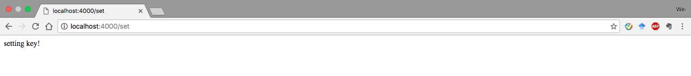
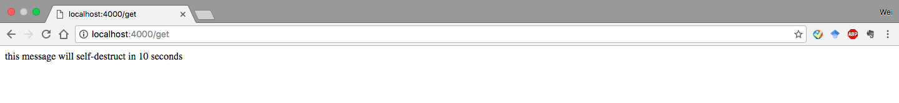
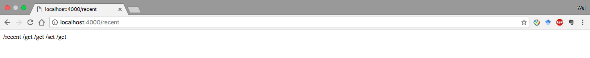
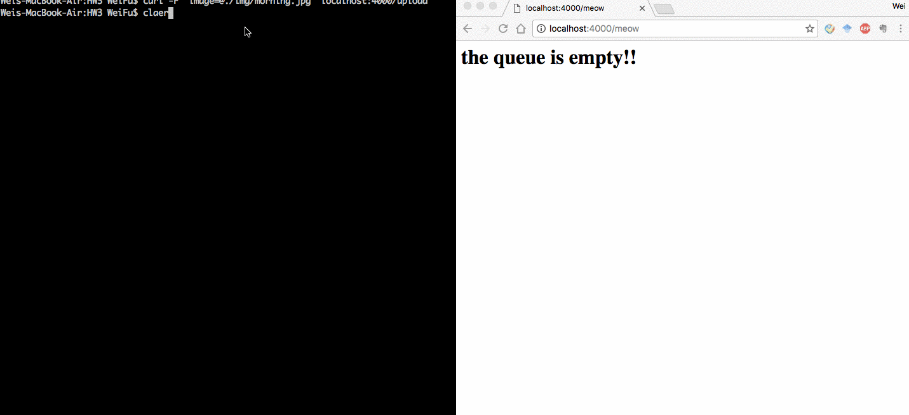
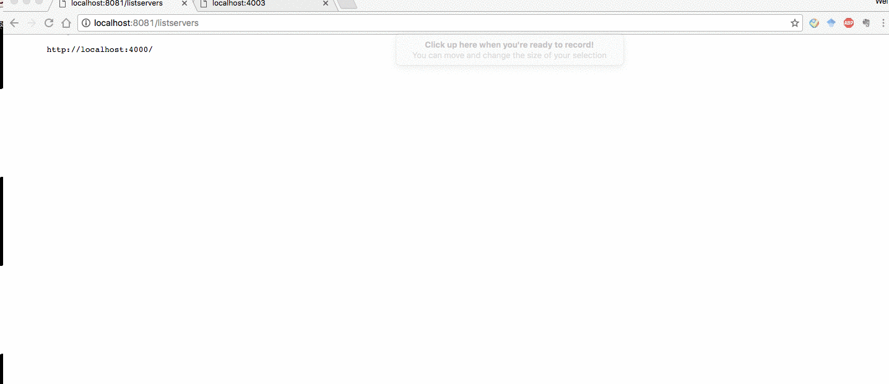

# HW #3 Proxies, Queues, Cache Fluency.

This homework is basically completed using the practice we learned from workshops

###Task1 Complete set/get 
In this task, 

* when users hit ```http://localhost:4000/set```, the server will store the key and corresponding values into redis server.

* when users hit ```http://localhost:4000/get```, the server will fetch value of the key from the redis server and display.


###Task2 Complete recent 

* when users hit ```http://localhost:4000/recent```, the server will return all the most recent visited urls on this server.


###Task3 Complete upload/meow
* Users can apply ```curl -F "image=@./img/morning.jpg" localhost:4000/upload``` to upload a picture into uplod folder and save into redis.
* Then users hit ```http://localhost:4000/meow```, the server will fectch the uploaded images from redis and disply in the browser.


###Task4 Complete spawn/destory/listservers

* When users hit ```/spawn```, it will generate an app server, which will be listening to a port
* When users hit ```/destroy```, it will destroy a random server.
* When users hit ```/listservers```, it will list all the available servers



###Task5 Demonstrate proxy
* Create a proxy that will uniformly deliver requests to available servers.
* E.g., if a visit happens to / then toggle between localhost:4000, localhost:4001, etc. 

### [Youtube Demo](https://youtu.be/Ty6y6kUcFPI)

